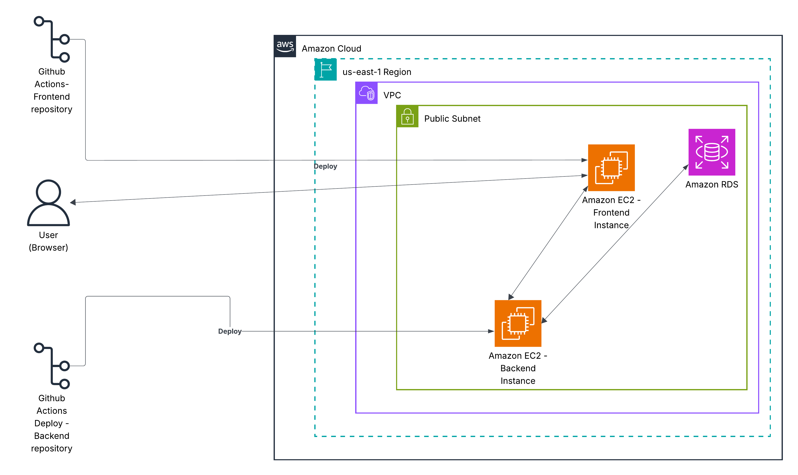
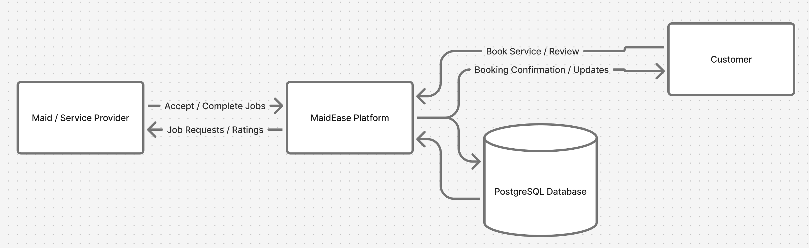
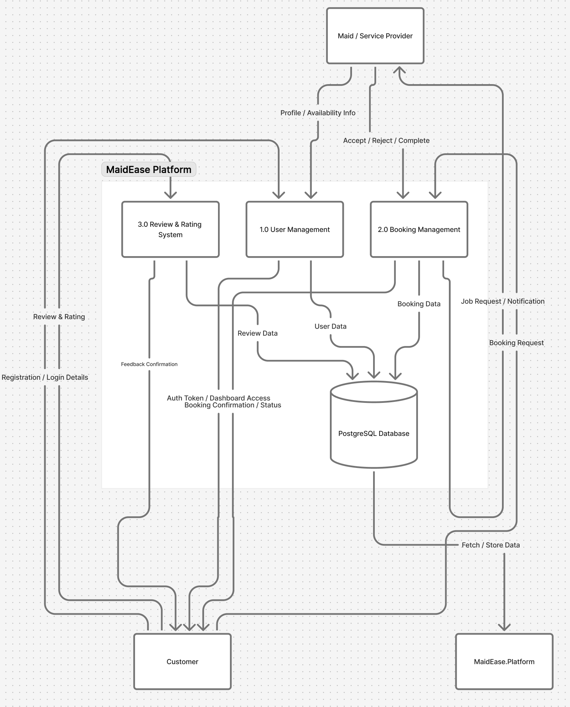
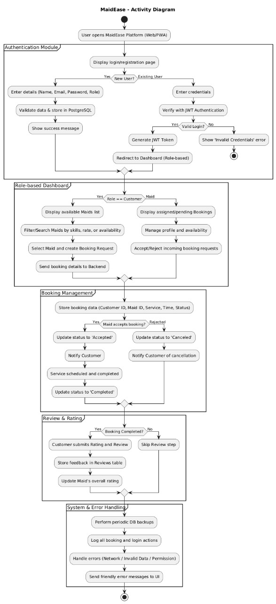

# **Schema Design & Architecture**

---

### **Database Schema Overview**

The PostgreSQL database schema is designed to be the single source of truth for the application. It is normalized to ensure data consistency and minimize redundancy.

**Core Tables:**

1. **Users**  
   Stores every account (customer or maid). Keep authentication and role here.

2. **Maid profiles**  
   Extra profile details for maids (skills, hourly rate, availability, rating, totals). One to one with `users` for rows where `role = 'maid'`.

3. **Bookings**  
   The transactional table: who booked whom, for what service/time, and the booking lifecycle (pending → accepted → completed, etc).

4. **Reviews**  
   Customer feedback tied to completed bookings. One review per booking (enforced in app logic).

5. **Notifications**  
   System-generated notifications (email/sms/in-app) created by the app or background worker and tracked until delivered.

---

**Mermaid ER Diagram (Data Modeling)**

[](https://mermaid.live/edit#pako:eNqtVm1v2jAQ_iuRv7BJtAqljJdvlKZb1gIVpN1UIUUmuQa3SRzZDpRR_vvOoSkQ0MrY8iXJ-Z7L3XOPz1kQj_tAWgTEJaOBoNEoHsUGXndDazA0FqsXfdk9x2C-cXu9Nt23B51v7YER0wh2rRBRFu6akwmPN7wd66djJFTKGRe-O6Fysl6zenddQ_AQjBH5VPJSqXgEolQuYWS_9HlENsLYXWvotLu3zoPhCaAKfJeq_es-hLC5vsxr7rbtS_d20L-yb6yPatemVIJw0X51XahnzHjBIp9ZGMq1cdht39zoGPCSgGAQe-DOgYoNFyzeGtgdY8JTEc5dgTWtF78P-70Lg06RYjoOwZUhV3uwdBpoIIuD7cwVVzR0n_hY7qcoTfzjKLzo96_t3tdD2Mv7WWRQr-kGF-2Xbccy_C0Wck0pFq0o2GUgEcyDgqSkoiqVmagSiH1kBzVFPQ8SrAkfWewmggcCpMQ3j0dJVq1-ptioEIri0x2mvq8Bx0nyaL4H1r1t_TiE7jHnz1jpPrYFTBnMDu_Eu3iL0sqIQL4iiNV_3pu9vmNf2Z22Y_d7x-7NP9CQ6ULNk9WoyUYXtltGcrvTueBkOn4CTxUqj7D_NDhIbRIZwtsjfgf-YZTpMH_P5Wq2v76enPBFYei1ME8cwrht-COmlue1hXjf49o5os8gc1Y_dhfgAZsiQusK0xdT3J4Gi4sRCtPkLVSu9jzLlXD3fnXTdSaYgk3vPf7b-tpMNQ9fTGYXoQQLAhAZgpRJIJhPWkqkUCY453TFeNJm0kXfCeChSTQsTsNQQ5aISWj8wHmUwwRPgwlpPdJQ4ttqSrwd1O8uqCkQHZ7GirSq1SwEaS3IC2lV6vXTqln7clat1xpmo9kskzlazVPTrJpNs9Fo1mv1eu18WSa_so-ap41mtVKrVxrnlbNqs3mGCPCZ4qK7-k3I_haWvwF2EF0-)

---

# **Indexing Strategy**

---

### **Auto Indexes**

- Every table’s **primary key (`id`)** is automatically indexed.
- Unique indexes are created on:
  - `users.email`
  - `users.phone`
  - `maid_profiles.user_id`

---

### **Indexes for Fast JOINs**

- `maid_profiles.user_id`
- `bookings.customer_id`
- `bookings.maid_id`
- `reviews.booking_id`
- `reviews.reviewer_id`
- `notifications.user_id`
- `notifications.booking_id`

---

### **Indexes for Frequent Searches**

- `bookings.date` — find bookings by date
- `bookings.status` — filter by booking status
- `maid_profiles.avg_rating` — show top maids
- `maid_profiles.available_slots` — check available time
- `reviews.maid_id` — get reviews of a maid
- `notifications.status` — check pending messages

---

### **System Architecture**

The application follows a standard three-tier architecture, a common and effective model for structuring web applications.

```
[React.js Frontend] <--> [FastAPI Backend] <--> [PostgreSQL Database]
```

*   **Presentation Layer (React.js PWA):** The client-side application that users interact with. It is responsible for rendering the UI and sending user-initiated requests to the backend.
*   **Application Layer (FastAPI Backend):** The server-side "brain" of the application. It contains all the business logic, handles API requests, manages user authentication, and communicates with the database.
*   **Data Layer (PostgreSQL Database):** The persistent storage layer where all application data is securely stored.

**Interconnections:**

*   The React frontend communicates with the FastAPI backend via HTTPS requests.
*   The FastAPI backend queries the PostgreSQL database to perform CRUD (Create, Read, Update, Delete) operations on the data.

### **AWS Specific Architecture Diagram**

This diagram shows a simplified view of the system hosted on AWS.




### **Data Flow**

**DFD Level 0**

This diagram gives a basic view of how data moves within the system. It shows the main entities: Customer, Maid or Service Provider, the MaidEase Platform, and the PostgreSQL Database, along with how they exchange information.
For example, customers can book a service, maids can accept or complete jobs, and all the related details are stored in the database through the platform.



**DFD Level 1**

This diagram takes it a step further and explains what happens inside the MaidEase Platform.
It includes key modules such as User Management, Booking Management, and Review and Rating System. Each of these modules performs specific functions like managing user accounts, processing bookings, and collecting feedback.
It helps visualize how data flows between users, internal modules, and the database to keep everything in sync.



**Activity DFD**

The activity diagram shows the complete workflow of the platform from start to finish.
It begins with login or registration, continues through booking and managing services, and ends with reviews and system operations.
This diagram provides a step by step look at how users interact with the system and how the platform processes each action, including authentication, booking confirmation, and error handling.


