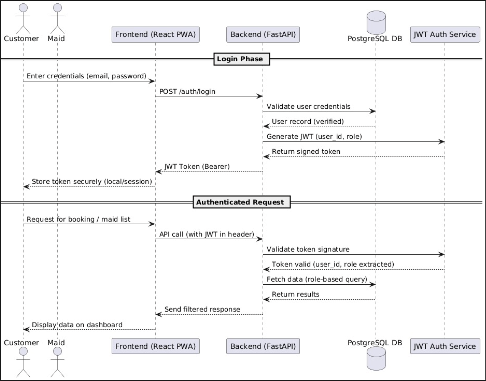

# **Authentication & Authorization Overview**

---

### **Authentication**

MaidEase uses a **token based authentication system**, a standard and secure method for protecting API endpoints and managing user sessions. When a user logs in, the system generates a unique token that must be sent with all subsequent requests to verify the user's identity.

---

### **Authentication Flow**

1.  **User Registration:** New users sign up by providing an email, password, and their designated role (**Customer** or **Maid**).

2.  **Login:** Upon successful login, the backend generates a **JSON Web Token (JWT)**. This token is sent to the client-side application and stored securely.

3.  **Authorization:** To access any protected endpoint, the client must include the JWT in the request's authorization header. The backend validates the token to ensure the user is authenticated and has the necessary permissions for the requested action.

4.  **Refresh Token:** When the access token expires, the frontend sends a POST request to /auth/refresh, where the backend validates the refresh token and issues a new access token.

5.  **Logout:** The logout process involves deleting the token from the client's storage, effectively ending the user's session.

---

### **Authentication Flow Diagram**

### **Authentication**

MaidEase uses a **Role-Based Access Control (RBAC)** model to manage what each user can do within the platform.
There are two main roles for authenticated users: Customer and Maid. Guests (unauthenticated users) have limited access.

**Permission Summary**

| **Feature / Action** | **Guest** | **Customer** | **Maid** | **Conditions / Notes** |
|-----------------------|:---------:|:-------------:|:--------:|------------------------|
| **Register / Login** | ✅ | ✅ | ✅ | All users can register and log in. |
| **View Maid Profiles** | ✅ | ✅ | ✅ | Guests see limited info; full access for logged-in users. |
| **Create / Manage Maid Profile** | ❌ | ❌ | ✅ | Only maids can edit their profile and availability. |
| **Create Booking** | ❌ | ✅ | ❌ | Customers can book available maids. |
| **View Bookings** | ❌ | ✅ | ✅ | Each user sees only their own bookings. |
| **Accept / Reject Booking** | ❌ | ❌ | ✅ | Only maids can accept or reject requests. |
| **Cancel Booking** | ❌ | ✅ | ✅ | Either party can cancel before completion. |
| **Mark as Completed** | ❌ | ❌ | ✅ | Maids can mark jobs complete. |
| **Post Review** | ❌ | ✅ | ❌ | Customers can review completed bookings. |
| **View Reviews** | ✅ | ✅ | ✅ | Publicly visible. |
| **Notifications** | ❌ | ✅ | ✅ | Automated system-triggered updates. |

