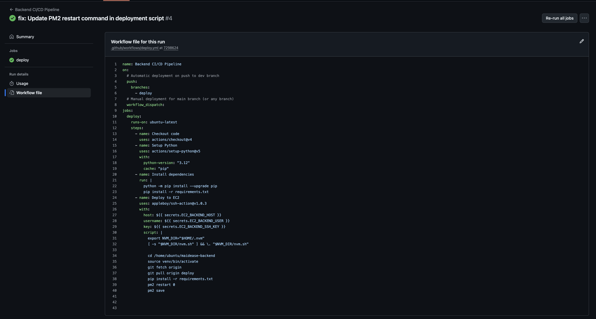
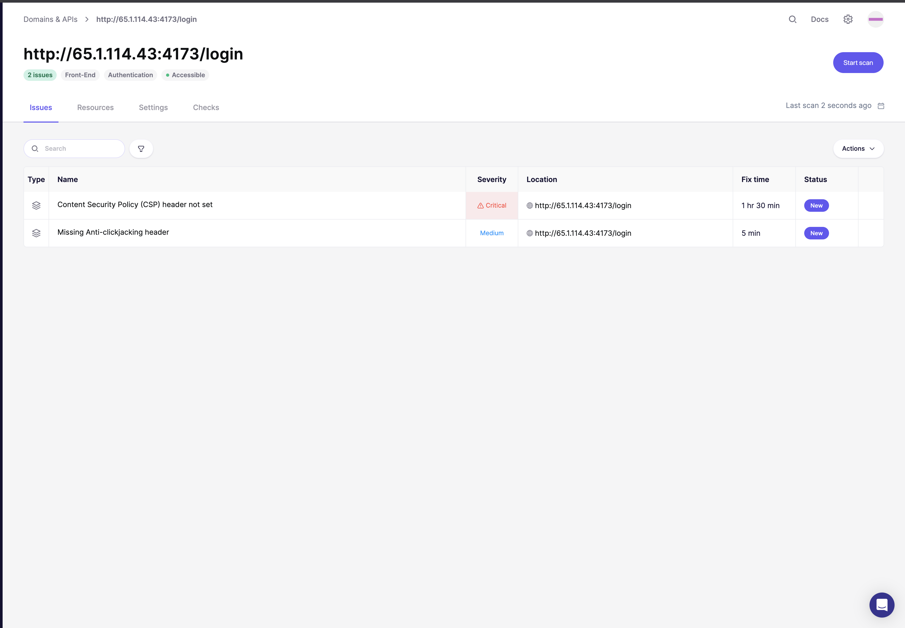

# CI/CD Pipeline and Deployment Flow

This document outlines the CI/CD pipeline for the MaidEase application, from code commit to deployment on AWS.

## 1. Overview

The CI/CD pipeline is triggered on every push to the deploy branch of the frontend and backend repositories. The pipeline is managed using CI/CD flow from GitHub Actions.

## Deployment Flow

The following diagram illustrates the complete deployment and operational flow of the MaidEase application, from development to user interaction.

## 1. Pipeline Triggers

### Branches

- `deploy`  
  Main deployment branch. Whenever I push to this branch, the CI/CD pipeline runs and deploys to the respective EC2 instance (frontend or backend).

### GitHub Actions Workflows

Each repo has its own workflow file:

GitHub Actions Workflow (.github/workflows/deploy.yml)

Backend 
- Deploy: automatically deployed to the deploy EC2 instance.

  `.github/workflows/deploy-backend.yml`

Frontend  
- Deploy: automatically deployed to the deploy EC2 instance.

-  `.github/workflows/deploy-frontend.yml`

### Deployment Steps:

1.  **Frontend Deployment**: The CI/CD pipeline, triggered by a push to the frontend repository's `deploy` branch, automatically deploys the frontend application to an **Amazon Backend EC2 instance**.
2.  **Backend Deployment**: Similarly, a push to the backend repository's `deploy` branch triggers the pipeline to deploy the backend application to another **Amazon Backend EC2 instance**.

## 2. Security Scanning (SAST & DAST)

**Tool**: Aikido Domain Scan(for both SAST & DAST)

## Backend SAST Summary 

**Total Issues Found: 3**

| Issue | Severity | What It Means |
|-------|----------|----------------|
| Unpinned GitHub Actions | Medium | The deploy workflow is not locked to a version, which can allow unwanted changes from third party actions. |
| python-multipart | Low | The multipart parser can be misused to create heavy requests that slow down the server. |
| python-jose | Low | Error messages can leak internal details if not handled carefully. |

These checks help keep the API, auth system and CI process safe.

---

## Frontend SAST Summary 

**Total Issues Found: 2**

| Issue | Severity | What It Means |
|-----------------|-----------------------------------------------|----------------------------------------------------------|
| Rollup XSS risk | Medium | The build process can allow unsafe input to reach the UI, which may create XSS problems. |
| 3rd party Github Actions should be pinned | Medium | The workflow uses unpinned versions, which can introduce supply chain risks. |

These scans protect the user interface and the build process from security issues.

---

## Security Scanning (DAST)

### Frontend DAST Summary

**Target area**: currently scanning the login page at the production URL.

**Total Issues Found: 2**

| Issue                                         | Severity | What It Means                                                                                                                  |
| --------------------------------------------- | -------- | ------------------------------------------------------------------------------------------------------------------------------ |
| Content Security Policy (CSP) header not set  | Critical | The application is missing a Content Security Policy, which makes it vulnerable to Cross-Site Scripting (XSS) and other injection attacks. |
| Missing Anti-clickjacking header              | Medium   | The lack of an X-Frame-Options header makes the application vulnerable to clickjacking attacks.                                  |

These scans protect the user interface and the build process from security issues.

---

