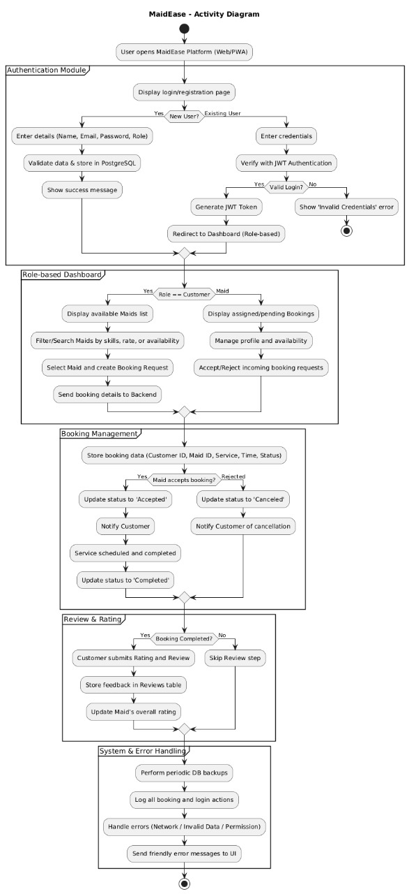

# **Schema design and Data Flow Diagrams**

---

# Core Tables Overview

## 1. Users
The Users table is the main foundation of the whole platform.  
Every person who uses the system is stored here.  
This includes customers, maids, and even admins.

It contains basic information:

- Name  
- Email  
- Hashed password  
- Phone number  
- Role (customer, maid, or admin)  
- Whether the account is active  

For maids, this table also stores their service details:

- Bio  
- Skills  
- Years of experience  
- Hourly rate  
- Average rating  

There is no separate maids table. If someone is a maid, their role and extra fields in this table describe them.

---

## 2. Bookings
This table stores all the actual service activity that happens in the app.  
Whenever a customer books a maid, a new booking record is created here.

Each booking includes:

- The customer who created the booking  
- The maid who will provide the service  
- The service type they selected  
- The booking date and time slot  
- The current status of the booking (like pending, accepted, completed, or canceled)  
- The total amount  
- Any notes or instructions  

---

## 3. Reviews
After a service is completed, customers can share feedback.  
Those reviews are stored here.

A review includes:

- The booking it is connected to  
- The customer who wrote the review  
- The maid who received the review  
- The rating  
- The comment  
- When the review was created or updated  

This table powers the rating system and helps customers understand the quality of service different maids provide.

---

**Mermaid ER Diagram (Data Modeling)**

[](https://mermaid.live/edit#pako:eNqtVF1r4zAQ_CtCz2lIajtO_XjX9AiF69HSOzgMQrE2tqg-jCSnzaX57yc7dpLGgbZQP0k7M6vd0VobnGkGOMFgrjnNDZWpQv57fJjdP6DNbtMEHufXiDP06_YQs85wlSOQlItetKC2AEZKau2zNqyHLyshiKISekhZaAVEVXIBpgcaLY4UC-23VCFuCc0cX_WTLbjuxewTF8Iewlw5BC8lGA4qA7IGao7QpdDUoUJXRqyJoQ5OIboCQ3OoMZ_9gDLPdVwCygz4JSPUnQGrkr0Bt6naLb7d3d3Of_549xaaWFZZpyUY4sGbU9DfDzsFOivArLjv2a1LOFOc9_fJ0wh703arrRnECu36WR11Vc9Cpx0VhEpdqb5EaQf2y7y7n_2ez_58zLqux3POfdrWepRO56DtMNNSgnJf1uPuF319vbjQm8OwJCjFXdVdazbF70nqXnr0PaNVdK7WgpaLDKw4PJ8_4Zi_r-mjgqaiIzIe4NxwhpMlFRYG2OeqKf7pai45xa4A_5jgWstgSSvhatnW60qq_motceJM5ZVGV3mxz7Pzt3389lEDioH5Xo8qTsZBkwMnG_yCkyCIhvFoHAfxOAzjcBR6dI2TaTQMJnE8ubyaXEXRNJhuB_hfc-poOA3CIAwvJ_E0jMaRh_4DaampUA)

---

### **AWS Specific Architecture Diagram**

This diagram shows a simplified view of the system hosted on AWS.

### **Data Flow**

**DFD Level 0**

This diagram gives a basic view of how data moves within the system. It shows the main entities: Customer, Maid or Service Provider, the MaidEase Platform, and the PostgreSQL Database, along with how they exchange information.
For example, customers can book a service, maids can accept or complete jobs, and all the related details are stored in the database through the platform.

**DFD Level 1**

This diagram takes it a step further and explains what happens inside the MaidEase Platform.
It includes key modules such as User Management, Booking Management, and Review and Rating System. Each of these modules performs specific functions like managing user accounts, processing bookings, and collecting feedback.
It helps visualize how data flows between users, internal modules, and the database to keep everything in sync.

**Activity DFD**

The activity diagram shows the complete workflow of the platform from start to finish.
It begins with login or registration, continues through booking and managing services, and ends with reviews and system operations.
This diagram provides a step by step look at how users interact with the system and how the platform processes each action, including authentication, booking confirmation, and error handling.

